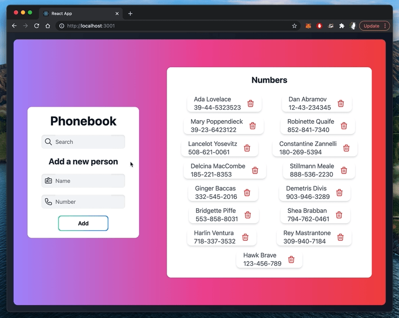

# Phonebook App

## About

This is the assignment that I've worked while doing Full Stack open course.
It's written using React (create-react-app) and Tailwind CSS in front-end; Express.js, Node.js and MongoDB in back-end. It was deployed to Heroku, although, it's not hosted at the moment.

Here's the demo;

Responsive and modern design:

Search, add and remove:

